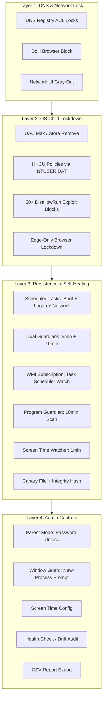

# OS-Guard + DNS-Guard

<div align="center">
  <div style="border-radius: 16px; overflow: hidden; display: inline-block; border: 2px solid #3b82f6;">
    
  </div>
</div>


Enterprise **OS Child Lockdown** + **DNS Hijack Protection** & Installer Suite (IPv4 & IPv6 + DoH)

A PowerShell hardening tool that enforces:
1. **DNS Registry ACL locks** on network adapter configurations, browser DoH blocking, and self-healing persistence.
2. **OS Child Lockdown** — auto-creates a passwordless `Child` standard user, enforces strict machine-wide and per-user policies, maxes UAC, removes Windows Store, and blocks CMD / Run / Control Panel / Regedit / TaskMgr for the child account.

Built-in Administrator retains full privileges to install, modify, and unlock.

---

## Quick Links

- [Features](#features)
- [Security Architecture](#security-architecture)
- [OS Child Lockdown](#os-child-lockdown)
- [About the OS Lockdown Script](#about-the-os-lockdown-script)
- [Installation](#installation)
- [CLI Usage](#cli-usage)
- [Interactive Menu](#interactive-menu)
- [Target Registry Paths](#target-registry-paths)
- [Tamper Detection](#tamper-detection)
- [Known Limitations](#known-limitations)
- [Changelog](#changelog)
- [Unreleased](#unreleased)

---

## Table of Contents

- [Features](#features)
- [Security Architecture](#security-architecture)
- [OS Child Lockdown](#os-child-lockdown)
- [About the OS Lockdown Script](#about-the-os-lockdown-script)
- [Installation](#installation)
- [CLI Usage](#cli-usage)
- [Interactive Menu](#interactive-menu)
- [Target Registry Paths](#target-registry-paths)
- [Tamper Detection](#tamper-detection)
- [Known Limitations](#known-limitations)
- [Changelog](#changelog)
- [Unreleased](#unreleased)

---

## Features

| Feature | Description |
| :--- | :--- |
| **Adapter Registry ACL Lock** | Denies `SetValue` to `Administrators` and `SYSTEM` on each network interface GUID under `Tcpip` and `Tcpip6` |
| **Browser DoH Block** | Injects machine-wide policies to disable DNS-over-HTTPS in Edge, Chrome, and Firefox |
| **GUI Padlock** | User Group Policy restrictions gray out the adapter properties UI (`ncpa.cpl`) |
| **Auto-Heal Persistence** | Scheduled tasks run at startup, logon, and network changes to re-apply locks |
| **Dual Guardians** | Two independent hidden tasks (`OSGuard-Guardian1` and `OSGuard-Guardian2`) monitor every 5 and 10 minutes |
| **WMI Subscription** | Third hidden layer monitors the Task Scheduler service; triggers if it is stopped or modified |
| **Integrity Hash** | SHA256 stored in a misleading registry key (`WpnPlatform\Settings\OSGuardIntegrity`) plus a file backup |
| **Global CLI** | After install, type `oslock` from any terminal to run commands |
| **Menu Tamper Blocking** | If the installed script is modified, options `[1]`, `[2]`, and `[3]` are blocked; only uninstall remains available |
| **OS Child Lockdown** | Auto-creates passwordless `Child` standard user; disables TaskMgr, Regedit, CMD, Run, Control Panel, Store, UAC modification, Installer, USB, WSH, SmartScreen, Fast User Switching |
| **Child Logon Task** | Applies HKCU restrictions directly in the child's session at every logon |
| **Child Hive Mount** | Loads `NTUSER.DAT` offline to enforce per-user policies even when the child is not logged in |
| **Admin-Approval Logout Shortcut** | Creates a `Log out` shortcut on the child's desktop flagged to run as administrator, so the child cannot log out without admin UAC approval |
| **Category Status Grid** | Interactive TUI shows a two-column grid of all 25+ lock categories with [ENABLED] / [DISABLED] / [UNKNOWN] indicators at a glance |
| **Parent Mode** | Admin enters a password-protected temporary unlock mode to install software or view the child account. Auto-relocks after 5 minutes of inactivity (AFK watcher). |
| **Parent Mode Window Guard** | Background process monitors for new windows while Parent Mode is active. If a new window appears (e.g., child uses admin mouse), a password prompt is shown immediately. 3 wrong passwords triggers instant lock. |
| **Parent Mode Admin Tools** | `Admin CMD.lnk` and `Admin PowerShell.lnk` dynamically appear on the admin desktop during Parent Mode with UAC elevation so the admin can quickly open elevated terminals. They are removed when exiting. |
| **Edge-Only Browser Lockdown** | `DisallowRun` entries 51-58 block Chrome, Firefox, Brave, Opera, Vivaldi, Waterfox, Tor, and Internet Explorer. Edge is the only allowed browser. |
| **Edge Deep Lockdown** | `BookmarkBarEnabled=0`, `InPrivateModeAvailability=1`, `DeveloperToolsAvailability=2`, `DownloadRestrictions=3`, `SyncDisabled=1`, `PasswordManagerEnabled=0`, `URLBlocklist`, `ExtensionInstallBlocklist=*` disable bookmarks, incognito, dev tools, downloads, extensions, settings access, and more. |
| **Screen Time Engine** | Admin-configurable daily activity hours (`DailyStart`/`DailyEnd`), daily max minutes, and browser-specific max minutes. `OSGuard-ScreenTime` watcher runs every minute as SYSTEM to track and enforce limits. |
| **Browser Request & Grant Flow** | Child desktop has `Browser Request.lnk` which shows a tamper-proof popup when clicked. Admin uses `Grant Browser Time` desktop shortcut (password-protected) to set session minutes (15/30/60/120). The child cannot set their own timer. |
| **Start Menu Lockdown** | `NoStartMenuPinnedList`, `NoStartMenuDragDrop`, `NoTrayContextMenu`, `NoMovingBands`, `NoCloseDragDropBands`, `DisableContextMenusInStart`, `NoBalloonTips` disable pinning, drag-drop, tray context menus, and taskbar manipulation. |
| **Notification Center Block** | `DisableNotificationCenter` and `DisableWindowsConsumerFeatures` block Action Center and suggested apps in the Start Menu. |
| **Game Request Shortcut** | Child has a "Request Game Install" shortcut on the desktop that opens a simple dialog to type a game name and send it to the admin. |
| **Lock Now / Continue Parent Mode** | Admin desktop shortcuts allow instant re-locking or resetting the AFK timer without opening the terminal. |
| **Parent Mode AFK Watcher** | 1-minute heartbeat scheduled task monitors idle time; if idle exceeds 5 minutes while parent mode is active, it auto-triggers `oslock -LockNow`. |
|| **PBKDF2 Password Hash** | Parent Mode password uses `Rfc2898DeriveBytes` with 100,000 iterations and a 32-byte random salt (Base64 stored in `OSGuardParentPasswordSalt`) to resist offline brute-force. Minimum 8 characters. |
| **Inline Watch Script** | `ParentModeWatch.ps1` is embedded as a Base64 string inside the main script and rewritten fresh on every silent heal; ACL hardened to SYSTEM only. |
| **Pre-Action Integrity Check** | `Enable-OSLock`, `Disable-OSLock`, and `Enter-ParentMode` re-verify script integrity immediately before executing (not just at menu render time). |
| **WMI Health Check** | `SilentLock` re-registers the `OSGuardWmiHealth` WMI subscription if the filter, consumer, or binding is missing. |
| **Task Scheduler Watch** | `SilentLock` monitors the `Schedule` service and auto-starts it if stopped. |
|| **Hardened Requests Directory** | `C:\ProgramData\OSGuard\Requests` grants the child `WriteData, AppendData` only (no read/list/delete); admins retain `ReadAndExecute`. |
|| **Canary File Tamper Detection** | A hidden canary file with a known SHA256 hash is created in `$InstallDir`. If it disappears or is modified, tamper lockout triggers immediately before the script hash even runs. |
|| **Task Scheduler Disablement Detection** | Detects if the `Schedule` service Start value is tampered to `4` (disabled). If so, tamper flag is set immediately. |
|| **Windows Event Log Logging** | Security/audit events are written to the Windows Application log under source `OS-Guard`, making logs tamper-resistant (child cannot delete Event Log). |
|| **WhatIf / DryRun Mode** | `-WhatIf` flag previews all registry, file, ACL, and process changes without applying them. Ideal for pre-deployment validation. |
|| **HealthCheck / Drift Audit** | `-HealthCheck` does a read-only scan of all tasks, registry values, ACLs, canary, and geofence status. Reports drift without fixing anything. |
|| **Performance Caching** | `Get-ChildSid` and `Get-ChildProfilePath` results are cached in `$script:CachedChildSid` and `$script:CachedChildProfilePath` to avoid repeated WMI/CIM calls in tight loops. |
|| **Skip Scan When Child Away** | `Scan-And-Harden-ChildPrograms` checks `Win32_LoggedOnUser` first; if the child is not logged in, the expensive recursive filesystem scan is skipped entirely. |
|| **Multi-Child Support** | `-ChildUsers` accepts an array of usernames (e.g., `@("Child1","Child2")`). The script loops through each child and applies all restrictions. |
|| **CSV Reporting** | `Export-OSGuardReport` exports lock status, tamper state, screen time usage, installed programs, and policy drift to a CSV for admin/MSP review. |
|| **White-Label Branding** | `-BrandingOrg "Contoso IT"` customizes the lockout screen text and Event Log entries. |
|| **Network-Level App Firewall** | `Invoke-OSGuardFirewall` uses `netsh advfirewall` to block outbound internet for child-installed programs and non-Edge browsers. |
|| **Wi-Fi SSID Geofencing** | `-HomeSSID "MyHomeWiFi"` auto-enables stricter lockdown (browser/game kill + firewall blocks) when the PC is not connected to the home network. |
|| **First Run Wizard** | `Show-SetupWizard` is a WinForms dialog that asks for child username, daily screen time limits, then auto-deploys. Removes the "read the menu" barrier. |
|| **Program Guardian Engine** | Scheduled task `OSGuard-ProgramScanner` scans the child profile every 10 minutes for newly installed programs, hardens their directories and shortcuts so the child cannot tamper with them, and blocks 50+ Windows built-in exploit tools via `DisallowRun` registry policies (Notepad, WordPad, Paint, Write, Explorer, PowerShell, pwsh, CMD, WSH, mshta, certutil, bitsadmin, wmic, regsvr32, rundll32, msiexec, msconfig, mmc, eventvwr, UAC bypass tools, taskkill, ftp, curl, robocopy, takeown, icacls, net, schtasks, at, cleanmgr, sdclt, control, .cpl, .msc, and more). Also disables `NoOpenWith`, `NoInternetOpenWith`, `NoSecurityTab`, `NoHardwareTab`, and `NoManageMyComputerVerb`. |

|---

## Architecture Diagram



## Quick Start

### Parent (Home PC)
1. Open PowerShell as Administrator.
2. Run: `C:\path\to\new2_OS_lockdown.ps1 -Install`
3. Write down the 12-character Parent Mode password shown on screen.
4. Log into the `Child` account. Everything is locked.
5. To unlock temporarily, switch to your admin account and double-click `Parent Mode` on the desktop, or run `oslock -ParentMode`.
6. When done, double-click `Lock Now` or run `oslock -LockNow`.

### School IT (Lab Deployment)
1. Copy the script to a network share or USB.
2. Run from a SYSTEM shell (e.g., `psexec -s`): `new2_OS_lockdown.ps1 -Install -BrandingOrg "District IT" -ChildUsers @("Student1","Student2")`
3. Use `oslock -HealthCheck` from any admin machine to audit drift without changing anything.
4. Use `oslock -ExportReport` to generate a CSV for compliance documentation.

### MSP (Managed Service Provider)
1. Set a white-label header: `new2_OS_lockdown.ps1 -Install -BrandingOrg "Contoso IT"`
2. Enable geofencing by setting the home/office SSID: `-HomeSSID "CorpWiFi5G"`
3. Schedule `oslock -HealthCheck` nightly via your RMM to email the CSV report.
4. If off-network, stricter lockdown (browser/game kill + firewall block) auto-triggers.

## Security Architecture

The script targets specific SIDs with `Deny` ACLs while leaving DHCP services untouched:

| SID | Name | Access |
| :--- | :--- | :--- |
| `S-1-5-32-544` | `BUILTIN\Administrators` | Deny `SetValue` |
| `S-1-5-18` | `NT AUTHORITY\SYSTEM` | Deny `SetValue` |
| `S-1-5-19` | `NT AUTHORITY\LocalService` | **Unchanged** (DHCP works) |

**File/Directory Hardening:**
|- `C:\ProgramData\OSGuard` — SYSTEM `FullControl`, Administrators `ReadAndExecute`
|- `C:\ProgramData\OSGuard\ParentModeWatch.ps1` — SYSTEM `FullControl`, Administrators `ReadAndExecute` (rewritten fresh from embedded Base64 on every silent heal)
|- `C:\ProgramData\OSGuard\Requests` — SYSTEM `FullControl`, Administrators `ReadAndExecute`, Child `WriteData, AppendData` only (no read/list/delete)
|- `C:\Windows\oslock.cmd` — SYSTEM `FullControl`, Administrators `ReadAndExecute`
|- `C:\ProgramData\DNSGuard` — Legacy path from DNS-Guard only install (see `new2.ps1`)
|- `C:\Windows\dnslock.cmd` — Legacy CLI wrapper from DNS-Guard only install

---

## OS Child Lockdown

When `new2_OS_lockdown.ps1` is installed, the following child-safe restrictions are enforced:

**Machine-wide (HKLM) policies:**
- UAC is maxed: `EnableLUA = 1`, `ConsentPromptBehaviorAdmin = 2`, `PromptOnSecureDesktop = 1`
- Windows Store is removed: `RemoveWindowsStore = 1`
- **Windows Installer blocked** for standard users: `DisableMSI = 2`, `DisableUserInstalls = 2`
- **USB storage disabled** to prevent software installation from USB: `USBSTOR Start = 4`
- **Windows Script Host disabled** (`wscript.exe` / `cscript.exe`)
- **SmartScreen enforced** at `Block` level for unknown apps and downloads
- **Fast User Switching disabled** so the child cannot switch to the Administrator without logging out
- **Windows Update UI blocked** for standard users
- Installer detection is enabled so the child cannot bypass UAC with unsigned installers

**Per-user (HKCU) policies applied to the child account only:**
- Task Manager: `DisableTaskMgr = 1`
- Registry Editor: `DisableRegistryTools = 1`
- Command Prompt: `DisableCMD = 2`
- Run dialog: `NoRun = 1`
- Control Panel & Settings: `NoControlPanel = 1`
- Wallpaper / theme changes: `NoChangingWallPaper = 1`, `NoThemesTab = 1`
- AutoPlay: `NoDriveTypeAutoRun = 255`
- Administrative Tools from Start Menu: hidden
- Add/Remove Programs: `NoAddRemovePrograms = 1`
- Windows Update UI: disabled
- Password change: `DisableChangePassword = 1`
- Network Connections UI: grayed out (`NC_LanProperties = 0`)
- Right-click context menu: disabled (`NoViewContextMenu = 1`)
- Folder Options: hidden (`NoFolderOptions = 1`) — prevents showing hidden/system files
- Taskbar changes: blocked (`NoSetTaskbar = 1`)
- Printer add/remove: blocked (`NoAddPrinter = 1`, `NoDeletePrinter = 1`)
- "This PC" icon: hidden from desktop and start menu (`{20D04FE0-3AEA-1069-A2D8-08002B30309D} = 1`)
- **Start Menu & Taskbar restrictions**: `NoStartMenuPinnedList` (no pinning to Start or taskbar), `NoStartMenuDragDrop` (no drag-and-drop in Start), `NoTrayContextMenu` (no right-click on tray icons), `NoMovingBands` (no moving taskbar toolbars), `NoCloseDragDropBands` (no closing/dragging toolbars), `NoBalloonTips` (no tray balloon tips), `DisableContextMenusInStart` (no right-click in Start menu)
- **Start Menu special folders hidden**: `NoStartMenuNetworkPlaces`, `NoStartMenuEjectPC`, `NoStartMenuMyGames`, `NoStartMenuMyMusic`, `NoStartMenuMyPictures`, `NoStartMenuMyVideos`, `NoStartMenuDownloads`, `NoStartMenuDocuments`, `NoStartMenuRecordings`, `NoStartMenuHomegroup`, `NoStartMenuFavorites`, `NoStartMenuRecentDocs`, `NoStartMenuRun`, `NoStartMenuFind`, `NoStartMenuHelp`, `NoStartMenuLogoff`
- **Notification Center & Consumer Features blocked**: `DisableNotificationCenter` (Action Center disabled), `DisableWindowsConsumerFeatures` (suggested apps removed from Start)
- **50+ Exploit Tools Blocked** via `DisallowRun` (entries 1-50): Notepad, WordPad, Paint, Write, Explorer, PowerShell, pwsh, CMD, wscript, cscript, mshta, certutil, bitsadmin, wmic, regsvr32, rundll32, msiexec, msconfig, mmc, eventvwr, fodhelper, computerdefaults, slui, dccw, xwizard, taskkill, ftp, tftp, telnet, curl, robocopy, takeown, icacls, net, net1, schtasks, at, cleanmgr, sdclt, systempropertiesadvanced, ms-settings, control, inetcpl.cpl, appwiz.cpl, compmgmt.msc, diskmgmt.msc, devmgmt.msc, taskmgr, regedit, perfmon
- **Additional Explorer Hardening**: `NoOpenWith`, `NoInternetOpenWith`, `NoSecurityTab`, `NoHardwareTab`, `NoManageMyComputerVerb`

**Child Account:**
- Account name: `Child` (configurable via `-ChildUser` parameter)
- Password: **passwordless** (`New-LocalUser -NoPassword`)
- Password change blocked: `net user Child /passwordchg:no /passwordreq:no`
- Membership: standard `Users` group only (never `Administrators`)
- Logout shortcut on desktop: requires admin UAC approval to run

**Admin Exemption:**
The built-in Administrator account is unaffected by all child restrictions and can:
- Run `oslock` from any terminal
- Use the interactive menu to lock/unlock
- Install or uninstall the service
- Modify all system settings

---

## About the OS Lockdown Script

`new2_OS_lockdown.ps1` is the flagship PowerShell hardening engine of the OS-Guard suite. It is designed from the ground up as a **defense-in-depth child safety and network protection system** for Windows 10 and Windows 11. The script is not a simple collection of registry tweaks — it is a fully autonomous, self-healing, tamper-aware enforcement platform that locks down the operating system at multiple layers while preserving full administrator freedom.

### Design Philosophy

The script was built around three core principles:

1. **Child-First, Admin-Free** — Once installed, the child account should require zero ongoing administrator interaction to stay protected. The system auto-heals, auto-relocks, and auto-enforces policies without manual intervention.
2. **Defense in Depth** — A single registry key or task is not enough. The script deploys overlapping layers: registry ACL locks, Group Policy injections, scheduled task guardians, WMI event subscriptions, file-system ACL hardening, integrity hashing, and real-time monitoring.
3. **Tamper Awareness** — The script knows when it has been modified. Every sensitive action re-verifies the script's SHA256 integrity hash before executing. If tampering is detected, the interactive menu blocks dangerous options and warns the administrator immediately.

### What the Script Does at a High Level

When you run `new2_OS_lockdown.ps1 -Install`, the script performs a systematic, multi-phase hardening operation:

**Phase 1 — Environment Preparation**
- Creates the hardened working directory `C:\ProgramData\OSGuard` with ACLs restricting the child to zero access while granting SYSTEM full control and Administrators read/execute access.
- Establishes the `C:\ProgramData\OSGuard\Requests` directory where the child can write game or browser requests but cannot read, list, or delete files — a one-way communication channel to the admin.
- Writes the global CLI wrapper `C:\Windows\oslock.cmd` so the `oslock` command is available from any terminal, any directory, without needing to know the install path.

**Phase 2 — DNS & Network Lockdown**
- Enumerates every active network adapter GUID on the machine.
- Applies `Deny SetValue` ACLs to `HKLM\SYSTEM\CurrentControlSet\Services\Tcpip\Parameters\Interfaces\{GUID}` and the corresponding `Tcpip6` paths for both the `BUILTIN\Administrators` and `NT AUTHORITY\SYSTEM` SIDs. This prevents anyone — including an elevated admin process — from changing the DNS server configuration on a locked adapter while the script is active.
- Injects machine-wide browser policies into Edge, Chrome, and Firefox to disable DNS-over-HTTPS (DoH), forcing all DNS queries through the locked adapter configuration.
- Applies user-level Group Policy restrictions that gray out the adapter properties UI (`ncpa.cpl`) so the child cannot even see the DNS fields, let alone change them.

**Phase 3 — OS Child Lockdown**
- Creates a passwordless standard user named `Child` (configurable via `-ChildUser`). The account is intentionally passwordless so the child can log in without typing a password, but it is locked into the `Users` group only — never `Administrators`.
- Password changes are blocked via `net user Child /passwordchg:no /passwordreq:no`.
- Injects machine-wide (HKLM) policies: UAC maxed (`EnableLUA = 1`, `ConsentPromptBehaviorAdmin = 2`, `PromptOnSecureDesktop = 1`), Windows Store removed (`RemoveWindowsStore = 1`), Windows Installer blocked for standard users (`DisableMSI = 2`, `DisableUserInstalls = 2`), USB storage disabled (`USBSTOR Start = 4`), Windows Script Host disabled (`wscript.exe` / `cscript.exe`), SmartScreen enforced at `Block` level, Fast User Switching disabled, and Windows Update UI blocked.
- Injects per-user (HKCU) policies into the child's registry hive: Task Manager disabled (`DisableTaskMgr = 1`), Registry Editor disabled (`DisableRegistryTools = 1`), Command Prompt disabled (`DisableCMD = 2`), Run dialog blocked (`NoRun = 1`), Control Panel & Settings hidden (`NoControlPanel = 1`), wallpaper and theme changes blocked, AutoPlay disabled (`NoDriveTypeAutoRun = 255`), Administrative Tools hidden from Start Menu, Add/Remove Programs blocked, password change blocked, Network Connections UI grayed out, right-click context menu disabled, Folder Options hidden, taskbar changes blocked, printer add/remove blocked, and the "This PC" icon hidden from desktop and Start Menu.
- Mounts the child's `NTUSER.DAT` offline (via `reg load`) to enforce HKCU policies even when the child is not currently logged in, ensuring restrictions survive reboots and logouts.

**Phase 4 — Browser Lockdown**
- Adds `DisallowRun` entries 51–58 to block `chrome.exe`, `firefox.exe`, `brave.exe`, `opera.exe`, `vivaldi.exe`, `waterfox.exe`, `tor.exe`, and `iexplore.exe`. Only Microsoft Edge remains allowed.
- Applies deep Edge machine policies: `BookmarkBarEnabled = 0`, `InPrivateModeAvailability = 1`, `DeveloperToolsAvailability = 2`, `DownloadRestrictions = 3`, `SyncDisabled = 1`, `PasswordManagerEnabled = 0`, `ExtensionInstallBlocklist = *`, and a URL blocklist covering `edge://settings`, `edge://extensions`, `edge://flags`, `edge://policy`, and `edge://downloads`. This strips Edge down to a minimal browsing surface where the child cannot install extensions, manage passwords, download files, open dev tools, or use incognito mode.

**Phase 5 — Screen Time Engine**
- Writes a default `ScreenTime.json` configuration to `C:\ProgramData\OSGuard` with admin-configurable daily start/end hours, daily maximum minutes, and browser-specific maximum minutes.
- Writes a `ScreenTimeTracker.json` that records daily usage, browser-specific usage, and any granted session allowances.
- Hardens both JSON files with ACLs: `SYSTEM:FullControl`, `Administrators:Read`, `Child:Deny`.
- Creates `BrowserLauncher.ps1` on the child's desktop. When the child clicks it, the launcher checks the screen time limit before opening Edge. If time is exhausted, it shows a tamper-proof popup explaining the limit.
- Creates `Browser Request.lnk` on the child's desktop so the child can request a browser session, but the request itself goes nowhere without admin action.
- Creates `Grant Browser Time.lnk` on the administrator's desktop. This shortcut requires the Parent Mode password and lets the admin grant 15, 30, 60, or 120 minutes of temporary browser time.
- Registers the `OSGuard-ScreenTime` scheduled task, which runs every minute as `NT AUTHORITY\SYSTEM` with the `-ScreenTimeEnforce` flag. The task tracks active Edge processes, updates the tracker, and forcefully terminates Edge if the daily or browser-specific limit is exceeded.

**Phase 6 — Exploit Tool & Start Menu Lockdown**
- Blocks 50+ Windows built-in exploit and system tools via `DisallowRun` entries 1–50: Notepad, WordPad, Paint, Write, Explorer, PowerShell, pwsh, CMD, wscript, cscript, mshta, certutil, bitsadmin, wmic, regsvr32, rundll32, msiexec, msconfig, mmc, eventvwr, fodhelper, computerdefaults, slui, dccw, xwizard, taskkill, ftp, tftp, telnet, curl, robocopy, takeown, icacls, net, net1, schtasks, at, cleanmgr, sdclt, systempropertiesadvanced, ms-settings, control, inetcpl.cpl, appwiz.cpl, compmgmt.msc, diskmgmt.msc, devmgmt.msc, taskmgr, regedit, and perfmon.
- Applies Start Menu & Taskbar restrictions: `NoStartMenuPinnedList`, `NoStartMenuDragDrop`, `NoTrayContextMenu`, `NoMovingBands`, `NoCloseDragDropBands`, `DisableContextMenusInStart`, `NoBalloonTips`.
- Hides Start Menu special folders: Network Places, Eject PC, My Games, My Music, My Pictures, My Videos, Downloads, Documents, Recordings, Homegroup, Favorites, Recent Documents, Run, Find, Help, and Logoff.
- Blocks Notification Center (`DisableNotificationCenter`) and Windows Consumer Features (`DisableWindowsConsumerFeatures`) to remove suggested apps from the Start Menu.
- Applies additional Explorer hardening: `NoOpenWith`, `NoInternetOpenWith`, `NoSecurityTab`, `NoHardwareTab`, `NoManageMyComputerVerb`.

**Phase 7 — Persistence & Self-Healing**
- Registers the main scheduled task `OSGuard-SilentLock` that runs at system startup and every network adapter state change, executing `oslock -SilentLock` to re-apply all locks.
- Registers `OSGuard-Guardian1` (every 5 minutes) and `OSGuard-Guardian2` (every 10 minutes) as independent hidden tasks that re-apply the full lockdown if anything is missing.
- Registers `OSGuard-ChildLogon` to apply HKCU restrictions directly inside the child's session at every logon.
- Registers `OSGuard-ProgramScanner` to scan the child profile every 10 minutes for newly installed programs, harden their directories and shortcuts, and refresh the exploit tool blocklist.
- Registers `OSGuard-ParentModeAFK` as a 1-minute heartbeat that monitors idle time during Parent Mode and auto-triggers `oslock -LockNow` if the admin is idle for more than 5 minutes.
- Creates a WMI event subscription (`OSGuardWmiHealth`) that monitors the Task Scheduler service. If the service is stopped or its configuration is modified, the subscription auto-triggers a re-lock.
- Computes a SHA256 integrity hash of the installed script and stores it in the registry under `HKLM\SOFTWARE\Microsoft\WpnPlatform\Settings\OSGuardIntegrity` (a misleading key name) and in a backup file under `C:\ProgramData\OSGuard`. The hash is checked before every sensitive action.

**Phase 8 — Parent Mode & Admin Tools**
- Implements a password-protected `Parent Mode` that temporarily disables the OS lockdown so the administrator can install software, update drivers, or modify settings. Parent Mode is entered via `oslock -ParentMode` and requires a PBKDF2 password (100,000 iterations, 32-byte salt, minimum 8 characters) stored in the registry.
- While Parent Mode is active, a background `ParentModeWatch.ps1` process monitors for new visible windows. If a new window appears (e.g., the child uses the admin's mouse), a password prompt is shown immediately. Three wrong passwords trigger instant re-lock.
- Dynamically creates `Admin CMD.lnk` and `Admin PowerShell.lnk` on the admin desktop during Parent Mode for quick elevated terminal access. These are removed automatically when exiting Parent Mode.
- Provides `oslock -ContinueParentMode` to reset the AFK timer and `oslock -LockNow` to exit Parent Mode and re-lock immediately without waiting for idle timeout.

**Phase 9 — Program Guardian Engine**
- Scans the child's Desktop, Start Menu, `AppData\Local\Programs`, and `AppData\Roaming\Microsoft\Windows\Start Menu` for program shortcuts and executable directories.
- Hardens discovered directories with ACLs so the child cannot modify, delete, or tamper with installed software.
- Refreshes the `DisallowRun` blocklist on every scan to catch any new exploit tools the child may have copied into their profile.

### Script Architecture & Internal Structure

The script is organized into modular functions rather than a linear execution flow:

- **Core Functions** — `Test-Admin`, `Get-IntegrityHash`, `Verify-Integrity`, `Harden-Directory`, `Harden-FileACL`, `Set-RegistryPolicy`, `Remove-RegistryPolicy`, `Get-ChildProfilePath`, `Get-ChildSID`
- **DNS Lock Functions** — `Get-ActiveAdapters`, `Lock-Adapter`, `Unlock-Adapter`, `Lock-DoH`, `Unlock-DoH`, `Lock-GUI`, `Unlock-GUI`
- **OS Lock Functions** — `Enable-OSLock`, `Disable-OSLock`, `Apply-ChildHivePolicies`, `Remove-ChildHivePolicies`, `Apply-EdgePolicies`, `Remove-EdgePolicies`
- **Screen Time Engine** — `Harden-ScreenTimeFile`, `Get-ScreenTimeConfig`, `Set-ScreenTimeConfig`, `Get-ScreenTimeTracker`, `Update-ScreenTimeTracker`, `Reset-ScreenTimeTrackerIfNewDay`, `Test-ScreenTimeLimit`, `Invoke-ScreenTimeEnforcement`, `Show-SetScreenTimeDialog`, `Show-ScreenTimeStatus`, `Show-GrantBrowserTimeDialog`, `New-BrowserLauncher`, `New-BrowserRequestShortcut`, `New-GrantBrowserTimeShortcut`, `Install-ScreenTimeWatcher`, `Remove-ScreenTimeWatcher`
- **Parent Mode Functions** — `Test-ParentPassword`, `Set-ParentPassword`, `Enter-ParentMode`, `Exit-ParentMode`, `Start-ParentModeWatch`, `Stop-ParentModeWatch`, `Add-ParentModeAdminTools`, `Remove-ParentModeAdminTools`, `Install-ParentModeAFK`, `Remove-ParentModeAFK`
- **Persistence Functions** — `Install-Persistence`, `Uninstall-Persistence`, `Install-GuardianTasks`, `Remove-GuardianTasks`, `Install-ChildLogonTask`, `Remove-ChildLogonTask`, `Install-WmiSubscription`, `Remove-WmiSubscription`, `Install-ProgramScanner`, `Remove-ProgramScanner`
- **Interactive UI** — `Show-Menu`, `Show-Status`, `Show-CategoryGrid`, `Show-ChildPanel`
- **CLI Dispatcher** — The `param` block handles `-Install`, `-Uninstall`, `-Lock`, `-Unlock`, `-SilentLock`, `-ChildLock`, `-ChildUser`, `-ParentMode`, `-SetParentPassword`, `-ChildGameRequest`, `-ContinueParentMode`, `-LockNow`, `-ProgramScan`, `-SetScreenTime`, `-ScreenTimeStatus`, `-GrantBrowserTime`, `-ScreenTimeEnforce`

### File & Registry Footprint

**Installed files and directories:**
- `C:\ProgramData\OSGuard\` — Main install directory (SYSTEM:FullControl, Administrators:ReadAndExecute)
- `C:\ProgramData\OSGuard\OS_Lockdown.ps1` — The installed payload copy
- `C:\ProgramData\OSGuard\integrity_hash.txt` — Integrity hash backup
- `C:\ProgramData\OSGuard\ParentModeWatch.ps1` — Embedded Base64 watch script (rewritten fresh on every silent heal)
- `C:\ProgramData\OSGuard\Requests\` — One-way child request directory
- `C:\ProgramData\OSGuard\ScreenTime.json` — Screen time configuration
- `C:\ProgramData\OSGuard\ScreenTimeTracker.json` — Screen time usage tracker
- `C:\ProgramData\OSGuard\BrowserLauncher.ps1` — Child-facing browser launcher
- `C:\Windows\oslock.cmd` — Global CLI wrapper
- `C:\Users\<Child>\Desktop\Browser Request.lnk` — Child browser request shortcut
- `C:\Users\<Admin>\Desktop\Grant Browser Time.lnk` — Admin grant-time shortcut
- `C:\Users\<Admin>\Desktop\Admin CMD.lnk` and `Admin PowerShell.lnk` — Dynamic Parent Mode tools

**Registry footprint:**
- `HKLM\SOFTWARE\Microsoft\WpnPlatform\Settings\OSGuardIntegrity` — Integrity hash
- `HKLM\SOFTWARE\Microsoft\WpnPlatform\Settings\OSGuardParentPasswordHash` — Parent Mode password hash
- `HKLM\SOFTWARE\Microsoft\WpnPlatform\Settings\OSGuardParentPasswordSalt` — Parent Mode password salt
- `HKLM\SOFTWARE\Policies\Microsoft\Edge\` — Edge deep lockdown policies
- `HKLM\SOFTWARE\Policies\Microsoft\Windows\` — Various OS policy branches
- `HKLM\SYSTEM\CurrentControlSet\Services\Tcpip\Parameters\Interfaces\{GUID}` — DNS ACL locks
- `HKCU\Software\Microsoft\Windows\CurrentVersion\Policies\Explorer\DisallowRun` — 50+ exploit tool blocks (in child hive)
- `HKCU\Software\Microsoft\Windows\CurrentVersion\Policies\Explorer\DisallowRun` entries 51–58 — Browser blocks (in child hive)

### Who Should Use This Script

`new2_OS_lockdown.ps1` is purpose-built for:
- **Parents** who want a locked-down, safe Windows environment for their children without buying third-party parental control software.
- **Shared family PCs** where the child account must be restricted but the administrator account must remain fully functional.
- **Small organizations** or **schools** that need a lightweight, zero-cost OS hardening layer before deploying full MDM or GPO infrastructure.
- **IT administrators** who need a **quick, portable, single-file hardening script** that can be deployed via USB, network share, or RMM tool without requiring Group Policy domain infrastructure.

### What This Script Is NOT

- It is **not** a kernel-level security boundary. A determined attacker with physical access, a live USB, or Safe Mode can bypass it.
- It is **not** a replacement for enterprise MDM or Active Directory Group Policy. It is a local-only enforcement layer.
- It is **not** anti-malware. It does not scan for viruses or ransomware. It restricts the operating system surface area to reduce the child's ability to cause harm or bypass network protections.
- It does **not** block the internet. It locks DNS to trusted servers and blocks alternative browsers, but the child can still browse the web through Edge within the configured screen time limits.

### Compatibility

- **Windows 10** (1903 and later) and **Windows 11** (all builds).
- **PowerShell 5.1** or **PowerShell 7+**.
- Requires **Administrator** rights for installation and most CLI flags.
- The `-Uninstall` flag requires **SYSTEM** identity (use `psexec -s` or run from a SYSTEM shell) to prevent the child from uninstalling the protection.
- Works on **Windows 10/11 Home**, Pro, Enterprise, and Education editions. On Home editions, some `LocalUser` cmdlets may fall back to `net user` automatically.

---

## Installation

1. Open PowerShell as Administrator.
2. Choose the script that matches your needs:

**DNS-only protection (legacy):**
```powershell
.\new2.ps1 -Install
```

**Full OS + DNS child lockdown:**
```powershell
.\new2_OS_lockdown.ps1 -Install
```

Or open the interactive menu and select option `[3]`.

This will:
- Copy the payload to `C:\ProgramData\OSGuard` (or `C:\ProgramData\DNSGuard` for DNS-only)
- Harden the directory ACLs
- Create the `oslock` CLI wrapper in `C:\Windows` (or `dnslock` for DNS-only)
- Register scheduled tasks (main + two guardians + child logon task)
- Register a WMI event subscription
- Store the integrity hash in the registry
- Create the passwordless `Child` account (OS lockdown only)
- Apply all DNS and OS locks immediately

---

## CLI Usage

After installation, the global `oslock` command is available from any terminal:

| Flag | Action | Required Identity |
| :--- | :--- | :--- |
| `-Install` | Install persistence and service | Admin |
| `-Uninstall` | Remove everything | **SYSTEM only** |
| `-Lock` | Apply DNS + OS locks immediately | Admin |
| `-Unlock` | Remove DNS + OS locks immediately | Admin |
| `-SilentLock` | Background re-apply (used by tasks) | SYSTEM |
| `-ChildLock` | Apply HKCU restrictions in child session | Child user (auto) |
| `-ChildUser <name>` | Specify a custom child username | Admin |
| `-ParentMode` | Enter password-protected Parent Mode (temporary unlock) | Admin |
| `-SetParentPassword` | Interactively set the Parent Mode password | Admin |
| `-ChildGameRequest` | Open the child game request dialog | Child (auto) |
| `-ContinueParentMode` | Reset the AFK timer while in Parent Mode | Admin |
| `-LockNow` | Exit Parent Mode and re-lock immediately | Admin |
|| `-ProgramScan` | Trigger an immediate Program Guardian scan & hardening | Admin |
|| `-SetScreenTime` | Interactively set daily/hourly screen time limits | Admin |
|| `-ScreenTimeStatus` | Show child's current screen time usage | Child (auto) |
|| `-GrantBrowserTime` | Grant temporary browser minutes (password protected) | Admin |
|| `-ScreenTimeEnforce` | Background enforcement used by watcher task | SYSTEM |
|| `-HealthCheck` | Read-only drift audit of all tasks, registry, ACLs, canary | Admin |
|| `-WhatIf` | Preview all changes without applying them | Admin |
|| `-ExportReport` | Export CSV report of status, drift, screen time, programs | Admin |
|| `-FirstRun` | Launch the First Run Wizard (setup dialog) | Admin |
|| `-BrandingOrg <name>` | Set white-label branding (default: `OS-Guard`) | Admin |
|| `-HomeSSID <name>` | Set home Wi-Fi SSID for geofencing | Admin |
|| `-ChildUsers <array>` | Multi-child support: apply to multiple usernames | Admin |

**Uninstall from a SYSTEM shell:**

```powershell
psexec -s powershell.exe -File "C:\ProgramData\OSGuard\OS_Lockdown.ps1" -Uninstall
```

---

## Interactive Menu

Running the script without flags opens the live menu:

```text
=====================================================
   ENTERPRISE DNS LOCKOUT SUITE (INSTALLER EDITION)
=====================================================

 LIVE HARDWARE ADAPTER STATUS
=====================================================
  Hardware: Ethernet       | State: Up    | MAC: 52-54-00-CC-93-AA
  -> Security: [X] LOCKED (IPv4/IPv6)
-----------------------------------------------------

=====================================================
 SYSTEM POLICIES & PERSISTENCE
=====================================================
  [X] GPO Restrictions   -> ENFORCED (Browsers & GUI)
  [X] Background Service -> INSTALLED ('dnslock' active)
-----------------------------------------------------

=====================================================
 INTEGRITY CHECK
=====================================================
  [X] Script Integrity    -> VERIFIED
-----------------------------------------------------

 >>> SYSTEM IS SECURE: ZERO-TRUST PADLOCK ACTIVE <<<

-----------------------------------------------------
[1] DEPLOY LOCK (Secure All Active Adapters)
[2] REMOVE LOCK (Aangra / Restore Access)
|[4] UNINSTALL SERVICE (Remove background tasks & Unlock)
|[5] REFRESH SYSTEM STATUS
|[6] EXIT TERMINAL
|[7] ENTER PARENT MODE (Unlock with password)
|[8] LOCK NOW (Re-lock immediately)
|-----------------------------------------------------|
Select an administrative action (1-8):
```

- Option `[3]` is hidden when already installed.
- Options `[1]`, `[2]`, `[3]`, `[7]`, and `[8]` are blocked with a red warning if tampering is detected.
- **OS + DNS menu** (`new2_OS_lockdown.ps1`) also shows the **OS Child Lockdown** panel (UAC, Store, TaskMgr, Regedit status) and checks the `Child` account state.
- **Program Guardian** is shown in the menu as a green `[X]` when the `OSGuard-ProgramScanner` task is registered.

---

## Target Registry Paths

### Network Interfaces
- `HKLM\SYSTEM\CurrentControlSet\Services\Tcpip\Parameters\Interfaces\{GUID}`
- `HKLM\SYSTEM\CurrentControlSet\Services\Tcpip6\Parameters\Interfaces\{GUID}`

### Network UI Restrictions (User Policy)
- `HKCU\Software\Policies\Microsoft\Windows\Network Connections`
  - `NC_LanProperties` = `0`
  - `NC_LanChangeProperties` = `0`
  - `NC_AllowAdvancedTCPIPConfig` = `0`

### Browser DoH Policies (Machine Policy)
- `HKLM\SOFTWARE\Policies\Microsoft\Edge`
- `HKLM\SOFTWARE\Policies\Google\Chrome`
- `HKLM\SOFTWARE\Policies\Mozilla\Firefox\DNSOverHTTPS`

### OS Child Lockdown Policies (Machine Policy)
- `HKLM\SOFTWARE\Microsoft\Windows\CurrentVersion\Policies\System`
  - `EnableLUA = 1`
  - `ConsentPromptBehaviorAdmin = 2`
  - `PromptOnSecureDesktop = 1`
- `HKLM\SOFTWARE\Policies\Microsoft\WindowsStore`
  - `RemoveWindowsStore = 1`
- `HKLM\SOFTWARE\Policies\Microsoft\Windows\Installer`
  - `DisableMSI = 2`
  - `DisableUserInstalls = 2`
  - `DisableUserInstallsViaModifications = 1`
- `HKLM\SYSTEM\CurrentControlSet\Services\USBSTOR`
  - `Start = 4`
- `HKLM\SOFTWARE\Microsoft\Windows Script Host\Settings`
  - `Enabled = 0`
- `HKLM\SOFTWARE\Policies\Microsoft\Windows\System`
  - `EnableSmartScreen = 1`
  - `ShellSmartScreenLevel = Block`
- `HKLM\SOFTWARE\Microsoft\Windows\CurrentVersion\Policies\System`
  - `HideFastUserSwitching = 1`
- `HKLM\SOFTWARE\Policies\Microsoft\Windows\WindowsUpdate`
  - `DisableWindowsUpdateAccess = 1`

### OS Child Lockdown Policies (User Policy — Child account only)
- `HKCU\Software\Microsoft\Windows\CurrentVersion\Policies\System`
  - `DisableTaskMgr = 1`
  - `DisableRegistryTools = 1`
  - `DisableChangePassword = 1`
  - `NoThemesTab = 1`
- `HKCU\Software\Microsoft\Windows\CurrentVersion\Policies\ActiveDesktop`
  - `NoChangingWallPaper = 1`
- `HKCU\Software\Microsoft\Windows\CurrentVersion\Policies\Explorer`
  - `NoRun = 1`
  - `NoControlPanel = 1`
  - `NoDriveTypeAutoRun = 255`
  - `StartMenuAdminTools = 0`
- `HKCU\Software\Policies\Microsoft\Windows\System`
  - `DisableCMD = 2`
- `HKCU\Software\Microsoft\Windows\CurrentVersion\Policies\Explorer`
  - `NoViewContextMenu = 1`
  - `NoFolderOptions = 1`
  - `NoSetTaskbar = 1`
  - `NoAddPrinter = 1`
  - `NoDeletePrinter = 1`
- `HKCU\Software\Microsoft\Windows\CurrentVersion\Policies\NonEnum`
  - `{20D04FE0-3AEA-1069-A2D8-08002B30309D} = 1`

---

## Tamper Detection

If the installed script is modified without updating the integrity hash, the menu shows:

```text
  [ ] Script Integrity    -> TAMPER DETECTED

  >>> TAMPER DETECTED! ACTION REQUIRED <<<
  - Run a full antivirus scan immediately.
  - Do NOT use options [1] or [2] (they may run malicious code).
  - Use option [4] to uninstall, then reinstall from a clean source.
  - Check Task Scheduler for unknown tasks and remove them.
```

**How to check for malicious tasks:**
1. Press `Win + R`, type `taskschd.msc`, press Enter.
2. Click `Task Scheduler Library` on the left.
3. Look for tasks you do not recognize (sort by Author).
4. Double-click suspicious tasks and check the `Actions` tab.
5. Delete anything running `powershell.exe` or `cmd.exe` from unexpected paths.

Quick PowerShell check:
```powershell
Get-ScheduledTask | Where-Object {$_.TaskPath -eq '\' -and $_.Author -notmatch 'Microsoft'} | Select-Object TaskName, Author, State
```

---

## Known Limitations

- **Captive portals** (hotels, airports) may fail if you use static DNS. Unlock temporarily with option `[2]`, log in, then re-lock with `[1]`.
- **Corporate VPNs** (Cisco, Fortinet) that rewrite adapter DNS may conflict with the lock. WFP-based VPNs (Proton) are unaffected.
- **Admin attacker with `takeown` / `psexec -s`** can still bypass the script. This is a Windows discretionary ACL limitation, not a script flaw. The script raises the effort required but does not create a kernel-level security boundary.
- **Offline boot** (live USB, Safe Mode) bypasses all protections.
- **Child account must log in once** before offline NTUSER.DAT hive policies can be applied. If the child has never logged in, the `ChildLogon` scheduled task will apply HKCU policies at the first logon.
- **Windows 10/11 Home** may not have `Get-LocalUser` / `New-LocalUser` cmdlets available in older builds; the script falls back to `net user` where possible.
- **Program Guardian** only discovers programs already installed in the child profile at scan time; it does not prevent the child from running portable executables stored outside scanned directories. Admins should install software into the child Desktop, Start Menu, or `AppData\Local\Programs` so the engine can find and harden it.
- **Parent Mode Window Guard** is a best-effort heuristic: it polls every 5 seconds for new visible processes while Parent Mode is active. A determined child who can quickly interact with a newly opened window before the guard detects it may bypass the prompt. The guard catches most accidental or slow interactions.
- **DisallowRun** blocks 50+ exact executable names (including `powershell.exe`, `pwsh.exe`, `cmd.exe`, `mshta.exe`, `mmc.exe`, `eventvwr.exe`, `fodhelper.exe`, etc.). A determined attacker can rename a copy of these tools, but this defeats casual child tampering. The shell blocks launches from Run dialog, Start menu, and double-click; already-running processes are not terminated.
- **Edge-Only Lockdown** blocks other browsers via `DisallowRun` 51-58. A child could still use Edge WebView or rename a blocked binary, but casual browsing is restricted to Edge only. Edge policies can be overridden by a user with local admin rights or by booting into Safe Mode.
- **Screen Time Engine** tracks usage via a JSON tracker under `C:\ProgramData\OSGuard`. A child with local admin rights or SYSTEM access could delete or edit the tracker. The engine is best-effort and relies on the `OSGuard-ScreenTime` scheduled task running every minute. If the task is stopped, enforcement is delayed until the next minute.

---

## FAQ

**Q: What if my child reboots the PC?**
A: All locks are registered as scheduled tasks that run at boot and logon. The child reboots into the same locked state.

**Q: How do I change the Parent Mode password?**
A: Double-click `Set Parent Mode Password` on the admin desktop, or run `oslock -SetParentPassword` from an elevated terminal.

**Q: Can I whitelist a game?**
A: Enter Parent Mode, then double-click `Approve Child Install` on the admin desktop. This opens a 15-minute window where you can install software into the child account. After 15 minutes, ACLs are automatically re-hardened.

**Q: The script says "TAMPER DETECTED." What should I do?**
A: Do NOT use Lock/Unlock/Parent Mode options. Use option `[4]` (Uninstall) to remove the script, then reinstall from a clean source. The tamper detection may have been triggered by a Windows Update that changed a protected file. Reinstalling from a clean copy resolves it.

**Q: Can I use this on a laptop that travels?**
A: Yes. Use the `-HomeSSID` parameter with your home Wi-Fi name. When the laptop is not on that network, stricter lockdown (browser kill + outbound firewall blocks) auto-enforces. When it reconnects to home Wi-Fi, normal rules apply.

**Q: Does the script support multiple children?**
A: Yes. Use the `-ChildUsers` parameter with an array: `-ChildUsers @("Child1","Child2")`. The script will loop through each child and apply all restrictions.

## Changelog

See [changelog.md](changelog.md) for a full list of changes, fixes, and security improvements.

---

## Unreleased

This section tracks upcoming and recently merged changes before they are tagged in a formal release.

- **OS Child Lockdown** added to `new2_OS_lockdown.ps1` (passwordless `Child` account, UAC max, Store removal, per-user policy blocks).
- **Stricter OS Lockdown** (2026-06-30): Windows Installer blocked, USB storage disabled, Windows Script Host disabled, SmartScreen enforced, Fast User Switching disabled, Windows Update UI blocked, right-click context menu disabled, Folder Options hidden, taskbar changes blocked, printer add/remove blocked, and "This PC" hidden.
- **Admin-Approval Logout Shortcut** added to the child's desktop (requires UAC elevation to run `shutdown /l`).
- **Interactive TUI Category Status Grid** added: a compact two-column grid showing all 25+ lock categories with [ENABLED] / [DISABLED] / [UNKNOWN] indicators so you can see every enabled and disabled category at a glance.
- **CLI renamed** from `dnslock` to `oslock` for the full OS+DNS suite (`new2_OS_lockdown.ps1`). The DNS-only `new2.ps1` still uses `dnslock`.
- **New regression tests** in `tests/` folder: `syntax_check.ps1` (auto syntax checker + chmod) and `test_os_lockdown.ps1` (read-only state verification).
- **Child Logon Task** (`OSGuard-ChildLogon`) ensures HKCU restrictions are reapplied at every child logon.
- **WMI subscription** renamed to `OSGuardWmiHealth`.
- **Edge-Only Browser Lockdown** (2026-06-29): `DisallowRun` 51-58 blocks Chrome, Firefox, Brave, Opera, Vivaldi, Waterfox, Tor, and Internet Explorer. Edge deep lockdown disables bookmarks, incognito, dev tools, downloads, sync, password manager, extensions, and settings access.
- **Screen Time Engine** (2026-06-29): Admin-configurable daily activity hours (`DailyStart`/`DailyEnd`), daily max minutes, and browser-specific max minutes. `OSGuard-ScreenTime` watcher runs every minute as SYSTEM. Browser Request & Grant Flow requires admin password to set session time.
- **Category Status Grid Bug Fix** (2026-06-29): Fixed `NullArrayIndex` error in `Show-CategoryGrid` caused by `[ordered]@{}` `.Keys` returning a non-indexable collection. Changed `$Keys = $Categories.Keys` to `$Keys = @($Categories.Keys)` to ensure proper array indexing.
- **PBKDF2 Password Hash** (2026-06-29): Replaced SHA-256 with `Rfc2898DeriveBytes` (100,000 iterations) for parent password storage. Salt size increased from 16 bytes to 32 bytes. Iteration count stored in registry for forward compatibility.
- **Canary File Tamper Detection** (2026-06-29): Added `.osguard.canary` hidden file with SHA256 hash check. Missing/modified canary triggers tamper lockout before script hash is even verified.
- **Task Scheduler Disablement Detection** (2026-06-29): Added `Test-TaskSchedulerTamper` to detect if `Schedule` service Start value is tampered to `4` (disabled).
- **Windows Event Log Logging** (2026-06-29): `Write-Log` now writes SECURITY/ERROR/WARN/AUDIT/ACTION events to the Windows Application log under source `OS-Guard`.
- **WhatIf / DryRun Mode** (2026-06-29): Added `-WhatIf` parameter that wraps all modifying calls in a preview-only mode.
- **HealthCheck / Drift Audit** (2026-06-29): Added `-HealthCheck` read-only mode that audits all tasks, registry values, ACLs, canary, and geofence status.
- **Performance Caching** (2026-06-29): `Get-ChildSid` and `Get-ChildProfilePath` now cache results in script-scoped hashtables to avoid repeated WMI/CIM calls.
- **Skip Scan When Child Away** (2026-06-29): `Scan-And-Harden-ChildPrograms` now checks `Win32_LoggedOnUser` and skips the expensive recursive scan if the child is not logged in.
- **Multi-Child Support** (2026-06-29): Added `-ChildUsers` parameter that accepts an array of usernames. Script loops through each child.
- **CSV Reporting** (2026-06-29): Added `Export-OSGuardReport` function that exports status, drift, screen time, and installed programs to CSV.
- **White-Label Branding** (2026-06-29): Added `-BrandingOrg` parameter. Customizes lockout screen and Event Log messages.
- **Network-Level App Firewall** (2026-06-29): Added `Invoke-OSGuardFirewall` using `netsh advfirewall` to block outbound internet for child-installed programs and non-Edge browsers.
- **Wi-Fi SSID Geofencing** (2026-06-29): Added `-HomeSSID` parameter. When not on the home network, stricter lockdown (browser/game kill + firewall blocks) auto-enforces.
- **First Run Wizard** (2026-06-29): Added `Show-SetupWizard` WinForms dialog for one-click initial setup (child name, screen time limits, auto-deploy).
- **README Rewrite** (2026-06-29): Added Mermaid architecture diagram, Quick Start for 3 personas (Parent, School IT, MSP), and FAQ section.
- **Strict Mode Registry Fix** (2026-06-30): Fixed `PropertyNotFoundException` errors caused by `Set-StrictMode -Version Latest` combined with dot-notation access on missing registry properties. Replaced all unsafe `(Get-ItemProperty ...).Prop` patterns with `Get-ItemProperty ... | Select-Object -ExpandProperty ... -ErrorAction SilentlyContinue`, which returns `$null` silently instead of throwing.
- **Category Grid [UNKNOWN] Fix** (2026-06-30): Fixed `Show-CategoryGrid` rendering `[UNKNOWN]` for all child-hive categories when the child has never logged in. Changed fallback values from `$null` to `$false` in the `else` block so they display as `[DISABLED]`. Added `$HiveLoaded` flag to track manual `reg.exe load` operations so `reg.exe unload` only runs when the script actually loaded the hive. Changed the Child Account check from inline `Get-LocalUser` to `Get-ChildAccount` for consistency.
- **Temporary Admin Unlock (Option 2 Toggle)** (2026-06-30): Menu option `[2]` becomes a toggle: press once to enter a temporary admin unlock (DNS + OS machine-wide policies removed, child account restrictions preserved), press again to re-lock. The `OSGuardTempUnlockActive` registry flag suppresses guardian re-locking, and the existing `OSGuard-ParentModeWatch` AFK watcher auto-triggers `oslock -LockNow` after 1 minute of inactivity. `Exit-ParentMode`, `Uninstall-Persistence`, and `Enable-OSLock` all clear the flag to prevent stale unlock state.
- **Temp Unlock Countdown Banner** (2026-06-30): When temporary unlock is active, the interactive menu displays a prominent countdown banner (`Countdown: mm:ss remaining`) calculated from the `OSGuardTempUnlockTimestamp` so the admin can see at a glance how much time remains before the 1-minute AFK auto-lock triggers.
- **Live Temp Unlock Countdown Window** (2026-06-30): A dedicated live countdown window pops up when temporary unlock is activated, updating every second with the remaining `mm:ss` time. The window is `TopMost`, fixed-size, and centered. Closing the window via the X button triggers immediate re-lock. The countdown reaching zero also auto-locks. The main script tracks the timer process via a PID file and kills it when the admin manually re-locks.

---

## Prerequisites

- Windows 10 or Windows 11
- PowerShell 5.1 or PowerShell 7+ (Admin rights required)
- `Set-ExecutionPolicy RemoteSigned` (or Bypass) to allow script execution

```powershell
Set-ExecutionPolicy RemoteSigned -Scope CurrentUser
```

