# OS-Guard Release Notes — Full Feature Showcase

**Product:** `new2_OS_lockdown.ps1` — Enterprise OS Child Lockdown + DNS Hijack Protection Suite
**Version:** Unreleased (2026-06-30)
**Platform:** Windows 10 / Windows 11
**Shell:** PowerShell 5.1 or PowerShell 7+ (Administrator / SYSTEM)

---

## Table of Contents

1. [Executive Summary](#executive-summary)
2. [Architecture Overview](#architecture-overview)
3. [Security Layer 1 — DNS & Network Lockdown](#security-layer-1--dns--network-lockdown)
4. [Security Layer 2 — OS Child Lockdown](#security-layer-2--os-child-lockdown)
5. [Security Layer 3 — Browser & Edge Lockdown](#security-layer-3--browser--edge-lockdown)
6. [Security Layer 4 — Screen Time Engine](#security-layer-4--screen-time-engine)
7. [Security Layer 5 — Persistence & Self-Healing](#security-layer-5--persistence--self-healing)
8. [Security Layer 6 — Tamper Detection & Integrity](#security-layer-6--tamper-detection--integrity)
9. [Security Layer 7 — Program Guardian](#security-layer-7--program-guardian)
10. [Admin Experience — Parent Mode & Controls](#admin-experience--parent-mode--controls)
11. [CLI Parameter Reference](#cli-parameter-reference)
12. [Deployment Scenarios](#deployment-scenarios)
13. [Recent Fixes & Hardening](#recent-fixes--hardening)
14. [Known Limitations & Trust Model](#known-limitations--trust-model)
15. [File & Registry Footprint](#file--registry-footprint)

---

## Executive Summary

`new2_OS_lockdown.ps1` is not a simple registry script. It is a **fully autonomous, defense-in-depth hardening platform** that transforms a standard Windows PC into a locked-down, child-safe environment while leaving the administrator account completely untouched and fully functional.

The system operates across **seven overlapping security layers**:

1. **DNS & Network Lockdown** — Registry ACL padlocks prevent any user (including elevated administrators) from changing DNS adapter settings, while browser DoH is disabled at the machine-policy level.
2. **OS Child Lockdown** — 50+ machine-wide and per-user policies block the child from installing software, changing settings, opening system tools, or escaping the sandbox.
3. **Browser & Edge Lockdown** — Only Microsoft Edge remains usable. All other browsers are blocked, and Edge itself is stripped down (no downloads, no incognito, no extensions, no dev tools, no password manager).
4. **Screen Time Engine** — Admin-configurable daily hours, daily max minutes, and browser-specific max minutes with a 1-minute SYSTEM heartbeat that kills Edge when limits are exceeded.
5. **Persistence & Self-Healing** — Six scheduled tasks, a WMI event subscription, and an embedded Base64 watch script ensure the system re-locks itself on every boot, logon, network change, and idle timeout.
6. **Tamper Detection & Integrity** — SHA256 integrity hashes, a hidden canary file, PBKDF2 password storage, and Task Scheduler disablement detection prevent the child (or malware) from silently weakening the protection.
7. **Program Guardian** — A 10-minute filesystem scan discovers newly installed software in the child profile and hardens its directories and shortcuts so the child cannot modify or delete them.

All of this is managed through a single-file PowerShell script that installs itself into `C:\ProgramData\OSGuard`, exposes a global `oslock` CLI command, and presents an interactive color-coded TUI with a live two-column category status grid.

---

## Architecture Overview

```mermaid
flowchart TB
    subgraph L1["Layer 1: DNS & Network Lock"]
        A1["Registry ACL Deny SetValue on Tcpip/Tcpip6 GUIDs"]
        A2["Browser DoH disabled (Edge, Chrome, Firefox)"]
        A3["Network UI grayed out (ncpa.cpl)"]
        A4["Netsh firewall outbound blocks for non-Edge browsers"]
    end

    subgraph L2["Layer 2: OS Child Lockdown"]
        B1["UAC maxed + Store removed + Installer blocked"]
        B2["USB storage disabled + WSH disabled"]
        B3["SmartScreen enforced + Fast User Switching disabled"]
        B4["50+ DisallowRun exploit tool blocks"]
        B5["HKCU policies via NTUSER.DAT (offline & live)"]
    end

    subgraph L3["Layer 3: Browser & Edge Lockdown"]
        C1["DisallowRun 51-58 blocks Chrome, Firefox, Brave, Opera, Tor, IE"]
        C2["Edge deep policies: no downloads, no incognito, no dev tools, no extensions, no sync, no password manager"]
        C3["URL blocklist for edge://settings, edge://flags, edge://extensions, etc."]
    end

    subgraph L4["Layer 4: Screen Time Engine"]
        D1["ScreenTime.json config (daily hours, max minutes, browser max)"]
        D2["ScreenTimeTracker.json (daily usage, allowances)"]
        D3["OSGuard-ScreenTime task: 1-minute SYSTEM heartbeat"]
        D4["Browser Request & Grant flow (password-protected)"]
    end

    subgraph L5["Layer 5: Persistence & Self-Healing"]
        E1["Main task: OS-Guard-Protection (boot + logon + network event)"]
        E2["Guardian1: 5-minute heartbeat"]
        E3["Guardian2: 10-minute heartbeat"]
        E4["ChildLogon: HKCU policy injection at every child logon"]
        E5["ProgramScanner: 10-minute filesystem scan + hardening"]
        E6["ScreenTime: 1-minute enforcement heartbeat"]
        E7["ParentModeWatch: 1-minute AFK idle monitor"]
        E8["WMI subscription: triggers if Schedule service is modified"]
    end

    subgraph L6["Layer 6: Tamper Detection & Integrity"]
        F1["SHA256 integrity hash in registry + backup file"]
        F2["Hidden canary file with SHA256 hash check"]
        F3["Task Scheduler disablement detection (Start=4)"]
        F4["PBKDF2 parent password (100k iterations, 32-byte salt)"]
        F5["Windows Event Log auditing (OS-Guard source)"]
    end

    subgraph L7["Layer 7: Program Guardian"]
        G1["Scan child profile for new installations"]
        G2["Harden discovered directories (child: ReadAndExecute only)"]
        G3["Harden .lnk shortcuts in Desktop & Start Menu"]
        G4["Re-apply DisallowRun blocklist on every scan"]
    end

    L1 --> L2 --> L3 --> L4 --> L5 --> L6 --> L7
```



---

## Security Layer 1 — DNS & Network Lockdown

### Registry ACL Padlock
For every active network adapter GUID, the script opens `HKLM\SYSTEM\CurrentControlSet\Services\Tcpip\Parameters\Interfaces\{GUID}` and the corresponding `Tcpip6` path, then applies a `Deny SetValue` ACL rule to both the `BUILTIN\Administrators` (`S-1-5-32-544`) and `NT AUTHORITY\SYSTEM` (`S-1-5-18`) SIDs.

This means:
- **Even an elevated PowerShell session cannot change the DNS server addresses** on a locked adapter.
- DHCP services (`NT AUTHORITY\LocalService`, `S-1-5-19`) are left untouched, so DHCP lease renewals continue to work.
- The lock survives reboots because the ACL is stored directly on the registry key.

### Browser DoH Blocking
Machine-wide Group Policy registry keys are injected into Edge, Chrome, and Firefox to disable DNS-over-HTTPS, forcing all DNS queries through the locked adapter configuration:
- `Edge` — `DnsOverHttpsMode = "off"`, `BuiltInDnsClientEnabled = 0`
- `Chrome` — `DnsOverHttpsMode = "off"`
- `Firefox` — `DNSOverHTTPS\Enabled = 0`

### Network UI Gray-Out
User-level policies (`HKCU\Software\Policies\Microsoft\Windows\Network Connections`) set `NC_LanProperties = 0`, `NC_LanChangeProperties = 0`, and `NC_AllowAdvancedTCPIPConfig = 0`, which gray out the adapter properties UI in `ncpa.cpl` so the child cannot even see the DNS fields.

### Firewall Integration
When geofencing is active or `Invoke-OSGuardFirewall` is triggered, the script uses `netsh advfirewall` to create outbound block rules for child-installed executables and non-Edge browsers (Chrome, Firefox, Opera, Brave, Vivaldi).

---

## Security Layer 2 — OS Child Lockdown

### Machine-Wide Policies (HKLM)
These apply to all users, but the built-in Administrator can still elevate and bypass:

| Policy | Registry Path | Value | Effect |
|--------|--------------|-------|--------|
| UAC Max | `HKLM\...\Policies\System` | `EnableLUA = 1`, `ConsentPromptBehaviorAdmin = 2` | Child cannot disable UAC |
| Store Removed | `HKLM\...\WindowsStore` | `RemoveWindowsStore = 1` | Microsoft Store is inaccessible |
| Installer Blocked | `HKLM\...\Windows\Installer` | `DisableMSI = 2`, `DisableUserInstalls = 2` | .msi and .exe installers cannot run as standard user |
| USB Disabled | `HKLM\SYSTEM\...\USBSTOR` | `Start = 4` | USB mass storage devices are disabled |
| WSH Disabled | `HKLM\...\Windows Script Host\Settings` | `Enabled = 0` | `wscript.exe` and `cscript.exe` are blocked |
| SmartScreen | `HKLM\...\Windows\System` | `EnableSmartScreen = 1`, `ShellSmartScreenLevel = Block` | Unknown apps and downloads are blocked |
| Fast User Switching | `HKLM\...\Policies\System` | `HideFastUserSwitching = 1` | Child cannot switch to admin without logging out |
| Windows Update UI | `HKLM\...\WindowsUpdate` | `DisableWindowsUpdateAccess = 1` | Standard users cannot open Windows Update settings |
| Notification Center | `HKLM\...\Explorer` | `DisableNotificationCenter = 1` | Action Center is disabled |
| Consumer Features | `HKLM\...\CloudContent` | `DisableWindowsConsumerFeatures = 1` | Suggested apps removed from Start Menu |

### Per-User Policies (HKCU — Child Account Only)
These are injected into the child's `NTUSER.DAT` via offline hive mount (`reg load`) so they apply even before the child has ever logged in. At first logon, the `OSGuard-ChildLogon` scheduled task also injects them into the live `HKCU` session.

| Policy | Effect |
|--------|--------|
| `DisableTaskMgr = 1` | Task Manager is blocked |
| `DisableRegistryTools = 1` | Registry Editor is blocked |
| `DisableCMD = 2` | Command Prompt is blocked |
| `NoRun = 1` | Run dialog is blocked |
| `NoControlPanel = 1` | Control Panel & Settings app are blocked |
| `NoViewContextMenu = 1` | Right-click context menu is disabled |
| `NoFolderOptions = 1` | Folder Options (show hidden files) is hidden |
| `NoSetTaskbar = 1` | Taskbar cannot be modified |
| `NoAddPrinter / NoDeletePrinter = 1` | Printer management is blocked |
| `NoChangingWallPaper / NoThemesTab = 1` | Wallpaper and theme changes are blocked |
| `NoDriveTypeAutoRun = 255` | AutoPlay is disabled for all drive types |
| `StartMenuAdminTools = 0` | Administrative Tools hidden from Start Menu |
| `NoAddRemovePrograms = 1` | Add/Remove Programs is blocked |
| `DisableChangePassword = 1` | Child cannot change their own password |
| `NoStartMenuPinnedList = 1` | Cannot pin apps to Start or taskbar |
| `NoStartMenuDragDrop = 1` | No drag-and-drop in Start Menu |
| `NoTrayContextMenu = 1` | No right-click on tray icons |
| `NoBalloonTips = 1` | No tray balloon tips |
| `DisableContextMenusInStart = 1` | No right-click in Start menu |
| 20+ `NoStartMenu...` policies | Network Places, Eject PC, My Games, My Music, My Pictures, My Videos, Downloads, Documents, Recordings, Homegroup, Favorites, Recent Docs, Run, Find, Help, Logoff are all hidden |
| `NoOpenWith = 1`, `NoInternetOpenWith = 1` | "Open With" dialog is blocked to prevent file browsing |
| `NoSecurityTab = 1`, `NoHardwareTab = 1` | Security and Hardware tabs are removed from file properties |
| `NoManageMyComputerVerb = 1` | "Manage" context menu on This PC is removed |

### 50+ Exploit Tool Blocks (DisallowRun 1–50)
The `DisallowRun` registry list blocks 50 built-in Windows executables that can be used to browse files, execute code, or bypass restrictions:

**File browsers:** `notepad.exe`, `wordpad.exe`, `mspaint.exe`, `write.exe`
**Shells & scripting:** `powershell.exe`, `pwsh.exe`, `cmd.exe`, `wscript.exe`, `cscript.exe`, `mshta.exe`
**System tools:** `certutil.exe`, `bitsadmin.exe`, `curl.exe`, `wmic.exe`, `regsvr32.exe`, `rundll32.exe`, `msiexec.exe`, `msconfig.exe`, `mmc.exe`
**UAC bypass vectors:** `eventvwr.exe`, `fodhelper.exe`, `computerdefaults.exe`, `slui.exe`, `dccw.exe`, `xwizard.exe`
**Network & file tools:** `ftp.exe`, `tftp.exe`, `telnet.exe`, `robocopy.exe`, `takeown.exe`, `icacls.exe`, `net.exe`, `net1.exe`, `schtasks.exe`, `at.exe`
**System utilities:** `taskkill.exe`, `cleanmgr.exe`, `sdclt.exe`, `systempropertiesadvanced.exe`, `ms-settings.exe`, `control.exe`, `inetcpl.cpl`, `appwiz.cpl`, `compmgmt.msc`, `diskmgmt.msc`, `devmgmt.msc`, `taskmgr.exe`, `regedit.exe`, `perfmon.exe`

### Child Account Creation
The script auto-creates a **passwordless** standard user named `Child` (configurable via `-ChildUser`):
- `New-LocalUser -NoPassword` (falls back to `net user /add /passwordreq:no` on Home editions)
- Added to `Users` group, explicitly removed from `Administrators`
- `net user Child /passwordchg:no /passwordreq:no` prevents password changes
- Admin-approval logout shortcut on the child's desktop requires UAC elevation to run `shutdown /l`

---

## Security Layer 3 — Browser & Edge Lockdown

### Edge-Only Policy
DisallowRun entries 51–58 block all alternative browsers:
- `chrome.exe`, `firefox.exe`, `brave.exe`, `opera.exe`, `vivaldi.exe`, `waterfox.exe`, `tor.exe`, `iexplore.exe`

Only Microsoft Edge remains launchable.

### Edge Deep Lockdown (HKLM Policies)
| Policy | Value | Effect |
|--------|-------|--------|
| `BookmarkBarEnabled` | `0` | Bookmarks bar is hidden |
| `EdgeCollectionsEnabled` | `0` | Collections feature is disabled |
| `BrowserAddProfileEnabled` | `0` | Cannot add new browser profiles |
| `BrowserGuestModeEnabled` | `0` | Guest mode is disabled |
| `BrowserSignin` | `0` | Cannot sign in to Edge with a Microsoft account |
| `DeveloperToolsAvailability` | `2` | DevTools (F12) is blocked |
| `InPrivateModeAvailability` | `1` | Incognito mode is blocked |
| `PasswordManagerEnabled` | `0` | Built-in password manager is disabled |
| `SyncDisabled` | `1` | Sync is disabled |
| `AllowDeleteBrowserHistory` | `0` | Cannot delete browsing history |
| `DownloadRestrictions` | `3` | Downloads are blocked entirely |
| `ForceGoogleSafeSearch` | `1` | SafeSearch is forced on Bing/Google |
| `ForceYouTubeRestrict` | `1` | YouTube Restricted Mode is forced |
| `PreventSmartScreenPromptOverride` | `1` | Cannot override SmartScreen warnings |
| `URLBlocklist` | 10+ entries | `edge://settings`, `edge://flags`, `edge://extensions`, `edge://downloads`, `edge://passwords`, `edge://history`, `edge://bookmarks`, `chrome://settings`, `chrome://flags`, `about:config` are all blocked |
| `ExtensionInstallBlocklist` | `*` | All extensions are blocked from installation |

---

## Security Layer 4 — Screen Time Engine

### Configuration (`ScreenTime.json`)
- `DailyStart` / `DailyEnd` — Allowed PC usage hours (e.g., `08:00` to `20:00`)
- `DailyMaxMinutes` — Total daily computer time (weekday)
- `BrowserMaxMinutes` — Total daily browser time (weekday)
- `WeekendDailyMaxMinutes` / `WeekendBrowserMaxMinutes` — Separate weekend limits

### Tracking (`ScreenTimeTracker.json`)
- `DailySecondsUsed` — increments every minute the child is active
- `BrowserSecondsUsed` — increments every minute Edge is running
- `BrowserAllowanceActive` / `BrowserAllowanceExpiry` — temporary admin-granted session
- `LastDate` — auto-resets to zero at midnight

### Enforcement (`OSGuard-ScreenTime` task)
Runs every minute as `NT AUTHORITY\SYSTEM` with `-ScreenTimeEnforce`:
1. Reads the current tracker and config.
2. If outside allowed hours, kills all child-owned browser processes.
3. If daily or browser limit exceeded, kills all child-owned browser processes.
4. If an admin-granted allowance is active and not expired, allows browsing.
5. Shows a Windows Forms popup: "Your browser time is up or outside allowed hours. Please ask your admin for more time."

### Browser Request & Grant Flow
- **Child** clicks `Browser Request.lnk` on their desktop → `BrowserLauncher.ps1` checks the tracker. If no allowance is active, shows a popup explaining they must ask the admin.
- **Admin** clicks `Grant Browser Time.lnk` on their desktop → password-protected dialog (`oslock -GrantBrowserTime`) asks for minutes (15, 30, 60, 120). The password is verified against the PBKDF2 hash stored in the registry. If correct, the allowance is written to the tracker file (which the child cannot modify due to ACL hardening).

---

## Security Layer 5 — Persistence & Self-Healing

The script installs **six independent scheduled tasks** plus a **WMI event subscription** to guarantee that locks are re-applied even if the child finds a way to disable one layer.

| Task | Interval | Trigger | Identity | Purpose |
|------|----------|---------|----------|---------|
| `OS-Guard-Protection` | Boot + Logon + Network Event | `AtStartup`, `AtLogOn`, Event ID 10000 | SYSTEM | Full re-apply of DNS + OS locks |
| `OSGuard-Guardian1` | 5 minutes | Infinite repetition | SYSTEM | Fast re-apply if main task is deleted |
| `OSGuard-Guardian2` | 10 minutes | Infinite repetition | SYSTEM | Slower backup guardian |
| `OSGuard-ChildLogon` | At child logon | `AtLogOn` (Child user) | Child (Limited) | Injects HKCU policies into live session |
| `OSGuard-ProgramScanner` | 10 minutes | Infinite repetition | SYSTEM | Scans child profile for new software and hardens it |
| `OSGuard-ScreenTime` | 1 minute | Infinite repetition | SYSTEM | Tracks usage and kills browsers when limits exceeded |
| `OSGuard-ParentModeWatch` | 1 minute | Infinite repetition | SYSTEM | Monitors idle time during Parent Mode; auto-locks after 5 min |
| `OSGuardWmiHealth` (WMI) | Event-driven | `__InstanceModificationEvent` on `Win32_Service` | SYSTEM | Triggers if Task Scheduler service is stopped or modified |

### Self-Healing Behavior (`SilentLock`)
Every time any of these tasks fires, the script runs `-SilentLock`, which:
1. Checks the canary file and SHA256 integrity hash.
2. Checks if the Task Scheduler service is running (starts it if stopped).
3. Checks if all scheduled tasks exist (recreates any missing ones).
4. Checks if the WMI subscription is intact (re-registers if filter/consumer/binding is missing).
5. Re-applies DNS locks and OS locks unless Parent Mode is currently active.
6. Triggers `Scan-And-Harden-ChildPrograms` and `Invoke-ScreenTimeEnforcement`.
7. Re-writes the `ParentModeWatch.ps1` script from the embedded Base64 string with fresh ACL hardening.

---

## Security Layer 6 — Tamper Detection & Integrity

### SHA256 Integrity Hash
At install time, the script computes a SHA256 hash of its own payload and stores it in two places:
- `HKLM\SOFTWARE\Microsoft\Windows\CurrentVersion\WpnPlatform\Settings\OSGuardIntegrity` (a misleading key name)
- `C:\ProgramData\OSGuard\integrity.sha256` (backup file)

Before every sensitive action (`Enable-OSLock`, `Disable-OSLock`, `Enter-ParentMode`, menu option execution), the hash is recomputed and compared. If they differ, the action is blocked and a red warning is shown: **"TAMPER DETECTED! ACTION REQUIRED"**.

### Canary File
A hidden file `.osguard.canary` is created in `$InstallDir` with 64 random bytes. Its SHA256 hash is stored in `.osguard.canary.sha256`. During `SilentLock`, the canary is checked **before** the script hash. If the canary is missing or modified, tamper lockout is triggered immediately. This catches deletion attacks where the entire install directory is wiped before the hash check can run.

### Task Scheduler Disablement Detection
If the `Schedule` service `Start` value is tampered to `4` (disabled), `Test-TaskSchedulerTamper` detects it during `SilentLock` and triggers the tamper flag.

### PBKDF2 Parent Password
The Parent Mode password is not stored in plaintext. It is hashed using `Rfc2898DeriveBytes` with:
- **100,000 iterations**
- **32-byte random salt** (Base64-encoded, stored in `OSGuardParentPasswordSalt`)
- **Minimum 8 characters**

This resists offline brute-force attacks even if the registry is extracted. A hardened `parent.hash` file is also written to `$InstallDir` so the tamper lockout screen can verify the password without needing registry access (since the child session cannot read the protected registry key).

### Windows Event Log Auditing
`Write-Log` writes all `SECURITY`, `ERROR`, `WARN`, `AUDIT`, and `ACTION` events to the Windows Application Log under the source `OS-Guard`. The child cannot delete Event Log entries, creating a tamper-resistant audit trail.

### Tamper Lockout Screen
If tampering is detected, a full-screen maximized WinForms window appears:
- Black background, red warning text: **"TAMPERING DETECTED — ADMIN REVIEW REQUIRED"**
- Blocks `Alt+F4` and `Escape` via `KeyPreview` handlers.
- Cannot be closed without entering the correct Parent Mode password.
- Provides a **VIEW LOGS** button to show the last 50 lines of the OS-Guard log.
- If closed without unlock, a **safe re-lock fallback** kills Explorer and re-applies all locks.

---

## Security Layer 7 — Program Guardian

### Discovery
`Get-ChildInstallDirectories` scans:
- `C:\Users\<Child>\AppData\Local\Programs`
- `C:\Users\<Child>\AppData\Local`
- `C:\Users\<Child>\AppData\Roaming`
- `C:\Users\<Child>\Desktop`
- `C:\Users\<Child>\Documents`
- Start Menu shortcuts (both user and system)

It uses `[System.IO.Directory]::EnumerateDirectories` for performance and filters out Windows system folders (`Microsoft`, `Windows`, `Temp`, `Packages`, etc.). A heuristic checks for `.exe`, `.dll`, or `.json` files to identify program directories.

### Hardening
`Harden-ProgramDirectory` applies ACLs to each discovered directory:
- **Owner:** `NT AUTHORITY\SYSTEM`
- **SYSTEM:** `FullControl` (inherit)
- **Administrators:** `FullControl` (inherit)
- **Child:** `ReadAndExecute` (inherit) — **can run the game**
- **Child:** `Deny Modify, Delete, WriteData, AppendData, ChangePermissions, TakeOwnership` — **cannot tamper with it**

`Harden-ProgramShortcuts` applies the same `Harden-FileACL` pattern to all `.lnk` files in the child's Desktop and Start Menu so the child cannot delete or rename shortcuts.

### Performance Optimization
If the child is not logged in (checked via `Win32_LoggedOnUser`), the expensive recursive scan is skipped entirely. Results are cached in `$script:CachedChildSid` and `$script:CachedChildProfilePath` to avoid repeated WMI calls during tight loops.

---

## Admin Experience — Parent Mode & Controls

### Parent Mode
When the admin needs to install software, update drivers, or modify settings, they enter **Parent Mode** via `oslock -ParentMode` or the `Parent Mode.lnk` desktop shortcut.

Parent Mode performs a **password-verified temporary unlock**:
1. Disables OS lockdown and DNS lockdown.
2. Re-applies installer policies (MSI block, Store removal, USB disable) so the child **still cannot install software** even while the admin is unlocked.
3. Removes HKCU restrictions from the child's live and offline hives.
4. Restarts Explorer so the unlock is visible immediately.
5. Creates `Admin CMD.lnk` and `Admin PowerShell.lnk` on the admin desktop with the "Run as administrator" flag for quick elevated terminal access.
6. Starts the **Window Guard** — a hidden background process that polls every 5 seconds for new visible windows. If a new window appears (e.g., the child touches the admin's mouse), a password prompt is shown. Three wrong passwords or Cancel triggers instant re-lock.
7. Sets the `OSGuardParentModeActive` flag and timestamp in the registry.

### AFK Watcher (`OSGuard-ParentModeWatch`)
A 1-minute scheduled task monitors the admin's idle time using `GetLastInputInfo` via inline C# (`IdleTime` class). If idle time exceeds 5 minutes while Parent Mode is active, it auto-triggers `oslock -LockNow` to re-lock the system. The admin can reset the timer by clicking `Continue Parent Mode` on the desktop or running `oslock -ContinueParentMode`.

### Lock Now (`oslock -LockNow`)
Immediately exits Parent Mode and re-locks everything. Restarts Explorer so the lock is visible immediately. Triggers `Scan-And-Harden-ChildPrograms` so any software installed during Parent Mode is hardened before the child can use it.

### Approve Child Install (`oslock -ApproveChildInstall`)
Provides a **15-minute software installation window**:
1. Prompts for Parent Mode password.
2. Relaxes ACLs on the child's `AppData\Local\Programs` directory so the admin can install software.
3. Schedules `OSGuard-ApproveInstallReharden` to run 15 minutes later, which re-hardens the directories and scans for new programs.
4. If Parent Mode is still active when the 15 minutes expire, the scheduled task also triggers **Lockback** — it stops Window Guard, removes admin tools, clears the Parent Mode flag, and re-locks the system.

### Game Request Flow
The child has a `Request Game Install.lnk` on their desktop. Clicking it opens a simple input dialog to type a game name. The request is saved to `C:\ProgramData\OSGuard\Requests\request_<timestamp>.txt`. The child has `WriteData, AppendData` permission on this directory but cannot read, list, or delete files — a **one-way communication channel** to the admin.

### Interactive TUI
Running the script without flags opens a live, color-coded menu:
- **DNS status** — adapter-by-adapter lock state with MAC addresses
- **OS Child Lockdown status** — UAC, Store, Installer, USB, WSH, SmartScreen, Fast User Switching, Windows Update, Task Manager, Registry Tools, CMD/Run, Control Panel, Wallpaper, AutoPlay, Admin Tools, Add/Remove Programs, Password Change, Network UI, Right-Click, Folder Options, Taskbar, Printers, This PC, Logout Shortcut
- **Category Status Grid** — a two-column compact grid showing all 25+ categories with `[ENABLED]` / `[DISABLED]` / `[UNKNOWN]` color-coded indicators
- **Integrity banner** — green "VERIFIED" or red "TAMPER DETECTED"
- **Tamper lockout banner** — if active, a red banner warns that the child session is locked

Menu options are **blocked** if tampering is detected (only Uninstall remains available).

---

## CLI Parameter Reference

| Parameter | Flag | Identity | Description |
|-----------|------|----------|-------------|
| `-Install` | | Admin | Full installation: copy payload, create tasks, apply locks, create child account |
| `-Uninstall` | | **SYSTEM only** | Complete removal: stop tasks, remove WMI, delete files, restore policies |
| `-Lock` | | Admin | Apply DNS + OS locks immediately |
| `-Unlock` | | Admin | Remove DNS + OS locks immediately (guardians will re-apply soon) |
| `-SilentLock` | | SYSTEM | Background re-apply used by all scheduled tasks |
| `-ChildLock` | | Child (auto) | Apply HKCU restrictions in the child's live session |
| `-ChildUser <name>` | | Admin | Specify a custom child username (default: `Child`) |
| `-ChildUsers <array>` | | Admin | Multi-child support: `-ChildUsers @("Child1","Child2")` |
| `-ParentMode` | | Admin | Enter password-protected temporary unlock mode |
| `-SetParentPassword` | | Admin | Interactively change the Parent Mode password |
| `-ChildGameRequest` | | Child (auto) | Open the game request dialog |
| `-ContinueParentMode` | | Admin | Reset the AFK idle timer |
| `-LockNow` | | Admin | Exit Parent Mode and re-lock immediately |
| `-ProgramScan` | | Admin | Trigger an immediate Program Guardian scan |
| `-SetScreenTime` | | Admin | Open the screen time configuration dialog |
| `-ScreenTimeStatus` | | Child/Admin | Show current screen time usage |
| `-GrantBrowserTime` | | Admin | Password-protected dialog to grant temporary browser minutes |
| `-ScreenTimeEnforce` | | SYSTEM | Background enforcement used by the 1-minute task |
| `-TamperLockout` | | Child (auto) | Show the full-screen tamper lockout window |
| `-ApproveChildInstall` | | Admin | Open a 15-minute software installation window |
| `-RehardenChildInstall` | | SYSTEM | Re-harden directories after the 15-minute approval window |
| `-HealthCheck` | | Admin | Read-only drift audit of all tasks, registry, ACLs, canary, geofence |
| `-WhatIf` | | Admin | Preview all changes without applying them |
| `-ExportReport` | | Admin | Export CSV report of status, drift, screen time, installed programs |
| `-FirstRun` | | Admin | Launch the First Run Wizard (WinForms setup dialog) |
| `-BrandingOrg <name>` | | Admin | White-label branding (default: `OS-Guard`) |
| `-HomeSSID <name>` | | Admin | Set home Wi-Fi SSID for geofencing |

---

## Deployment Scenarios

### Parent (Home PC)
```powershell
.\new2_OS_lockdown.ps1 -Install
```
1. Write down the 12-character Parent Mode password shown on screen.
2. Log into the `Child` account. Everything is locked.
3. To unlock temporarily, switch to your admin account and double-click `Parent Mode` on the desktop, or run `oslock -ParentMode`.
4. When done, double-click `Lock Now` or run `oslock -LockNow`.

### School IT (Lab Deployment)
```powershell
psexec -s powershell.exe -File ".\new2_OS_lockdown.ps1" -Install -BrandingOrg "District IT" -ChildUsers @("Student1","Student2")
```
- Use `oslock -HealthCheck` from any admin machine to audit drift without changing anything.
- Use `oslock -ExportReport` to generate a CSV for compliance documentation.

### MSP (Managed Service Provider)
```powershell
.\new2_OS_lockdown.ps1 -Install -BrandingOrg "Contoso IT" -HomeSSID "CorpWiFi5G"
```
- Schedule `oslock -HealthCheck` nightly via your RMM to email the CSV report.
- If off-network, stricter lockdown (browser/game kill + firewall block) auto-enforces.

---

## Recent Fixes & Hardening

### 2026-06-30T12:40:00Z — Strict Mode Registry Fix
**Problem:** `Set-StrictMode -Version Latest` (line 56) combined with `(Get-ItemProperty -Path ... -Name "Prop" -ErrorAction SilentlyContinue).Prop` threw `PropertyNotFoundException` when the registry property didn't exist, because dot-notation access on a `$null` object is fatal under strict mode.

**Fix:** Replaced all unsafe dot-notation patterns across the entire file with the safe pipeline pattern:
```powershell
Get-ItemProperty -Path $Path -Name $Name -ErrorAction SilentlyContinue | Select-Object -ExpandProperty $Name -ErrorAction SilentlyContinue
```
This returns `$null` silently when the property is missing instead of throwing. The fix was applied to `Show-CategoryGrid`, `Show-HealthCheck`, `Enable-OSLock` verification, `Test-ParentPassword`, `Start-WindowGuard`, and all other registry read sites.

### 2026-06-30T12:40:00Z — Category Grid [UNKNOWN] Fix
**Problem:** When the child account had never logged in, `NTUSER.DAT` did not exist and `Show-CategoryGrid` could not mount the child hive. The `else` block set all child-hive category values to `$null`, which rendered as `[UNKNOWN]` in the grid — confusing the admin into thinking the lockdown was incomplete.

**Fix:**
1. Changed all child-hive fallback values from `$null` to `$false` in the `else` block of `Show-CategoryGrid` so they display as `[DISABLED]` (the correct semantic state: the policies are not yet applied, but they are not enabled either).
2. Added a `$HiveLoaded` boolean flag to track whether the function manually loaded the hive via `reg.exe load`. `reg.exe unload` now only runs when the script actually loaded the hive, preventing unnecessary unload attempts on live sessions.
3. Changed the Child Account check from inline `Get-LocalUser` to `Get-ChildAccount` for consistency with the rest of the script.

---

## Known Limitations & Trust Model

- **Not a kernel boundary.** A determined attacker with physical access, a live USB, Safe Mode, or `psexec -s` can bypass the script. It raises the effort required but does not create a hardware or kernel-level security boundary.
- **Captive portals** may fail if DNS is locked. Unlock temporarily, authenticate, then re-lock.
- **Corporate VPNs** (Cisco, Fortinet) that rewrite adapter DNS may conflict. WFP-based VPNs (Proton, WireGuard) are unaffected.
- **Child must log in once** before offline `NTUSER.DAT` hive policies can be applied. The `ChildLogon` task handles first-time injection.
- **Windows 10/11 Home** may lack `Get-LocalUser` / `New-LocalUser` cmdlets; the script falls back to `net user` automatically.
- **Portable executables** stored outside scanned directories are not blocked by Program Guardian. Install software into the child's Desktop or `AppData\Local\Programs` so the engine can discover and harden it.
- **Screen Time tracker** is a JSON file under `C:\ProgramData\OSGuard`. A child with admin or SYSTEM rights could delete it. The engine is best-effort and relies on the 1-minute task running continuously.
- **Edge policies** can be overridden by a user with local admin rights or by booting into Safe Mode. The script is designed to prevent casual tampering, not defeat a skilled attacker.

---

## File & Registry Footprint

### Installed Files
| Path | Purpose | ACL |
|------|---------|-----|
| `C:\ProgramData\OSGuard\` | Main install directory | SYSTEM: FullControl; Admin: ReadAndExecute; Child: Deny |
| `C:\ProgramData\OSGuard\OS_Lockdown.ps1` | Installed payload copy | SYSTEM: FullControl; Admin: ReadAndExecute; Child: Deny |
| `C:\ProgramData\OSGuard\integrity.sha256` | Backup integrity hash | SYSTEM: FullControl; Admin: ReadAndExecute; Child: Deny |
| `C:\ProgramData\OSGuard\ParentModeWatch.ps1` | Embedded Base64 watch script | SYSTEM: FullControl; Admin: ReadAndExecute |
| `C:\ProgramData\OSGuard\Requests\` | One-way child request directory | SYSTEM: FullControl; Admin: ReadAndExecute; Child: WriteData/AppendData only |
| `C:\ProgramData\OSGuard\ScreenTime.json` | Screen time configuration | SYSTEM: FullControl; Admin: Read; Child: Deny |
| `C:\ProgramData\OSGuard\ScreenTimeTracker.json` | Screen time usage tracker | SYSTEM: FullControl; Admin: Read; Child: Deny |
| `C:\ProgramData\OSGuard\BrowserLauncher.ps1` | Child-facing browser launcher | SYSTEM: FullControl; Admin: ReadAndExecute; Child: ReadAndExecute |
| `C:\ProgramData\OSGuard\parent.hash` | PBKDF2 hash backup for lockout screen | SYSTEM: FullControl; Admin: ReadAndExecute; Child: Deny |
| `C:\Windows\oslock.cmd` | Global CLI wrapper | SYSTEM: FullControl; Admin: ReadAndExecute; Users: ReadAndExecute |
| `C:\Users\<Child>\Desktop\Log out.lnk` | Admin-approval logout shortcut | ACL-hardened |
| `C:\Users\<Child>\Desktop\Request Game Install.lnk` | Game request shortcut | ACL-hardened |
| `C:\Users\<Child>\Desktop\Browser Request.lnk` | Browser request shortcut | ACL-hardened |
| `C:\Users\<Admin>\Desktop\Parent Mode.lnk` | Enter Parent Mode | ACL-hardened |
| `C:\Users\<Admin>\Desktop\Lock Now.lnk` | Re-lock immediately | ACL-hardened |
| `C:\Users\<Admin>\Desktop\Continue Parent Mode.lnk` | Reset AFK timer | ACL-hardened |
| `C:\Users\<Admin>\Desktop\Approve Child Install.lnk` | 15-minute install window | ACL-hardened |
| `C:\Users\<Admin>\Desktop\Grant Browser Time.lnk` | Grant temporary browser time | ACL-hardened |

### Registry Footprint
| Path | Purpose |
|------|---------|
| `HKLM\SOFTWARE\Microsoft\Windows\CurrentVersion\WpnPlatform\Settings\OSGuardIntegrity` | SHA256 integrity hash |
| `HKLM\SOFTWARE\Microsoft\Windows\CurrentVersion\WpnPlatform\Settings\OSGuardParentPasswordHash` | PBKDF2 parent password hash |
| `HKLM\SOFTWARE\Microsoft\Windows\CurrentVersion\WpnPlatform\Settings\OSGuardParentPasswordSalt` | 32-byte salt (Base64) |
| `HKLM\SOFTWARE\Microsoft\Windows\CurrentVersion\WpnPlatform\Settings\OSGuardParentPasswordIterations` | Iteration count (100,000) |
| `HKLM\SOFTWARE\Microsoft\Windows\CurrentVersion\WpnPlatform\Settings\OSGuardParentModeActive` | Parent Mode flag (0/1) |
| `HKLM\SOFTWARE\Microsoft\Windows\CurrentVersion\WpnPlatform\Settings\OSGuardParentModeTimestamp` | Parent Mode activation timestamp |
| `HKLM\SOFTWARE\Microsoft\Windows\CurrentVersion\WpnPlatform\Settings\OSGuardTamperDetected` | Tamper lockout flag (0/1) |
| `HKLM\SOFTWARE\Policies\Microsoft\Edge\` | Edge deep lockdown policies |
| `HKLM\SOFTWARE\Policies\Microsoft\Windows\...` | Machine-wide OS policies |
| `HKLM\SYSTEM\CurrentControlSet\Services\Tcpip\Parameters\Interfaces\{GUID}` | DNS ACL locks (IPv4) |
| `HKLM\SYSTEM\CurrentControlSet\Services\Tcpip6\Parameters\Interfaces\{GUID}` | DNS ACL locks (IPv6) |
| `HKCU\Software\Microsoft\Windows\CurrentVersion\Policies\Explorer\DisallowRun` | 50+ exploit tool blocks (in child hive) |
| `HKCU\Software\Microsoft\Windows\CurrentVersion\Policies\Explorer\DisallowRun` | Browser blocks 51-58 (in child hive) |

---

## Closing Statement

`new2_OS_lockdown.ps1` is a single-file, self-contained, enterprise-grade hardening engine. It does not require Group Policy infrastructure, Active Directory, or third-party software. It installs in seconds, heals itself automatically, and presents a clear, color-coded status dashboard that tells the admin exactly what is locked and what is not.

The script is designed for **parents**, **schools**, and **small IT teams** who need a lightweight, zero-cost, portable hardening layer that works on Windows 10/11 Home, Pro, Enterprise, and Education without domain membership.

**It is not invincible — but it is relentless.** Every 5 minutes, every 10 minutes, every boot, every logon, and every network change, the guardians wake up and check their watch. If anything is missing, they put it back. If the canary is gone, they sound the alarm. If the child tries to wait out the timer, the timer resets them.

That is the OS-Guard promise: **set it, trust it, and forget it.**

---

*Document generated 2026-06-30T12:40:00Z*
*Co-Authored-By: Oz <oz-agent@warp.dev>*
